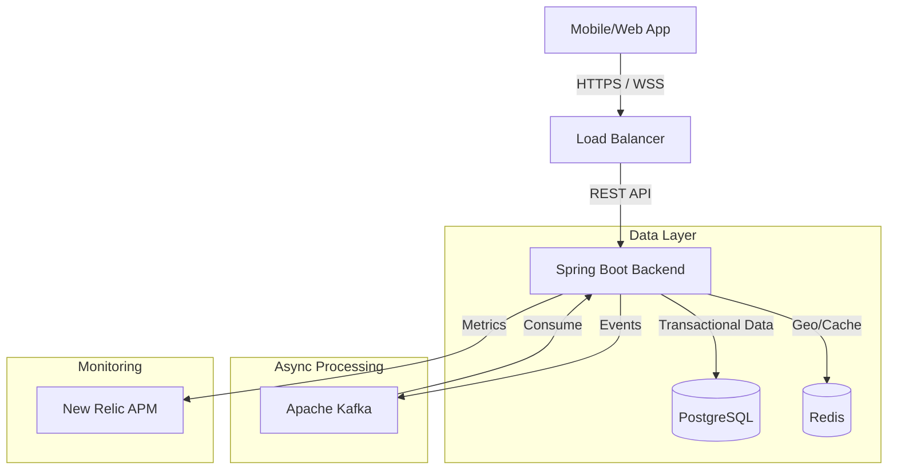

# System Design Document - Ride Hailing Backend

## 1. High-Level Design (HLD)

### Architecture Overview
The system follows a **Microservices-ready** architecture (currently a Modular Monolith) using Spring Boot, designed for high throughput and low latency.

### Key Components
1.  **API Gateway / Backend Core**: Handles REST requests and WebSocket connections (`/v1/**`, `/ws`).
2.  **Redis Geospatial Engine**: Stores driver locations (`GEOADD`) and performs radius search (`GEORADIUS`) for matching.
3.  **Kafka Event Bus**: Decouples high-volume updates (Location ingestion) from business logic.
4.  **PostgreSQL**: Source of truth for Users, Rides, and Payments.

## 2. Low-Level Design (LLD)

### Database Schema (PostgreSQL)

**Users Table**
- `id` (PK), `name`, `email`, `role` (RIDER/DRIVER)

**Rides Table**
- `id` (PK), `rider_id` (FK), `driver_id` (FK), `status` (REQUESTED, ACCEPTED, IN_PROGRESS, COMPLETED), `pickup_lat/lon`, `fare`.
- **Indexes**: `idx_ride_status`, `idx_ride_rider`, `idx_ride_driver`.

**Payments Table**
- `id` (PK), `ride_id` (FK), `amount`, `status`, `external_tx_id`.

### API Contracts

| Method | Endpoint | Description |
|--------|----------|-------------|
| POST | `/v1/rides` | Create a new ride request. |
| GET | `/v1/rides/{id}` | Get status of a ride. |
| POST | `/v1/drivers/{id}/location` | Update driver coordinates (Redis). |
| POST | `/v1/drivers/{id}/accept` | Accept a ride (Pessimistic Locking). |
| POST | `/v1/trips/{id}/end` | Complete trip and calculate fare. |

### Critical Flows

**1. Matching Flow (Driver Discovery)**
1.  Rider requests ride (`POST /rides`).
2.  Backend saves `Ride` to DB (Status: REQUESTED).
3.  Backend queries Redis `GEORADIUS` for drivers within 5km.
4.  (Future) Backend notifies eligible drivers via WebSocket.

**2. Ride Acceptance (Concurrency Control)**
1.  Driver calls `acceptRide`.
2.  Backend acquires `PESSIMISTIC_WRITE` lock on `Ride` row.
3.  Checks if `status == REQUESTED`.
4.  If yes, assigns driver and updates status.
5.  If no (race condition), throws error.

**3. Location Updates**
1.  Driver app sends coords every 3s.
2.  Backend pushes to Redis `drivers:geo` key.
3.  Key expires/updates in real-time.
